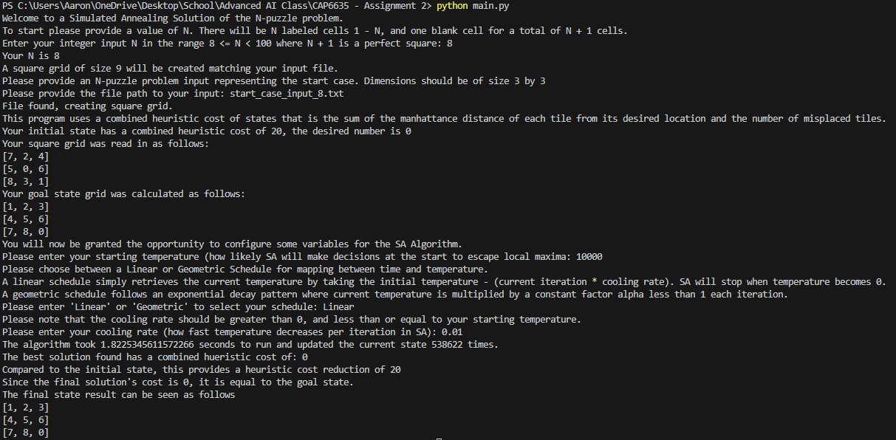
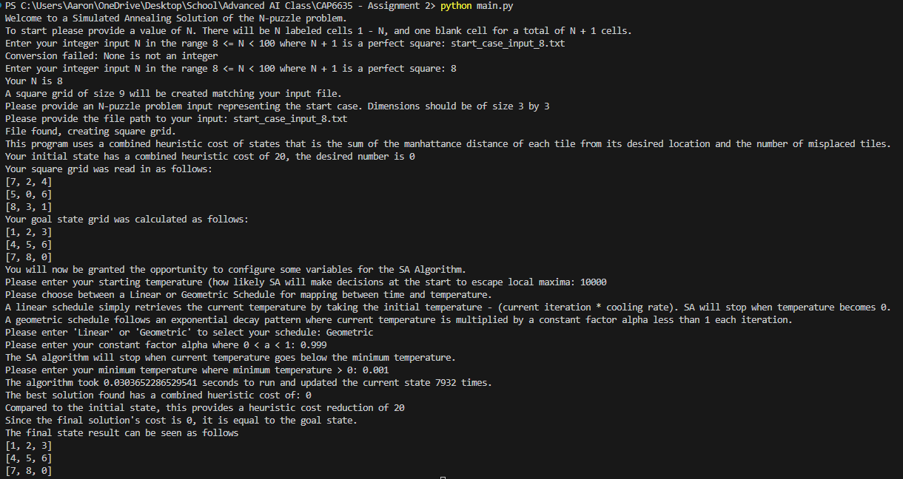

# N-Puzzle Problem Solver with Simulated Annealing

I created this project for my CAP6635 - Advanced AI class, taught by Dr. Ayan Dutta. The program in this repository implements the Simulated Annealing (SA) algorithm 
to solve N-puzzle problems for N in the range 8 to 99, both inclusive, where N + 1 is a perfect square. It includes linear and geometric cooling scheduler implementations
to find more efficient and effective ways to map from time to temperature. It uses a combined heuristic of the sum of each tile's Manhattan distance from its desired location + the number of misplaced tiles. Overall, I found the Geometric Scheduler more effective and efficient, at least on size 8 and 15 problems.

## Key Features and Summary 
- **Simulated Annealing Algorithm**: Utilize SA to solve the N-puzzle problem for perfect square N + 1 where N is 8 to 99.
- **Cooling Schedules**: This includes both linear and geometric scheduler class implementations, which the SA function can use interchangeably.
- **Customizable Parameters**: SA variables are highly customizable, meaning users can select their own starting temperature, cooling rate (linear), alpha value (geometric), and min temperature (geometric).
- **Interactive Prompt**: Interactive command line interface allows for easy experimentation of different values.
- **Puzzle Input**: The initial puzzle states are read from input text files.

## Getting Started

### Prerequisites

Ensure Python 3.x is installed on your system. You can download Python [here](https://www.python.org/downloads/).

### Installation

1. Clone the repository:

```bash
bash git clone Windz-GameDev/CAP6635-Advanced-AI-Solving-N-Puzzle-Problem-with-Simulated-Annealing.git
```

2. Navigate to the project directory:
```bash
cd CAP6635-Advanced-AI-Solving-N-Puzzle-Problem-with-Simulated-Annealing
```

### Usage

Run the main script using Python:
```bash
bash python main.py
```

Follow the interactive prompts to configure the SA algorithm and solve an N-puzzle problem. Here are two examples for both schedulers.

- Linear Scheduler:
  

- Geometric Scheduler:
  

## Future Work

- Implement more advanced heuristics to estimate state value better and improve algorithm effectiveness and efficiency. 
- Potentially implement a GUI for better visualization of the problem and solution.

# Acknowledgements 
- Thank you, Dr. Ayan Dutta, for introducing us to the N-Puzzle problem and some of the various algorithms and heuristics used to solve it.
- Additionally, thanks to https://aima.cs.berkeley.edu/ and its authors, Stuart Russell and Peter Norvig, for their Simulated Annealing pseudocode.
